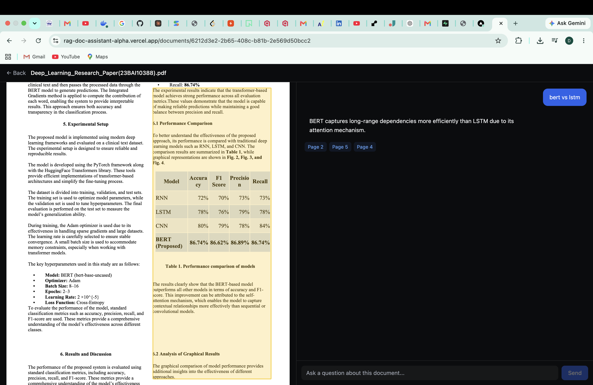
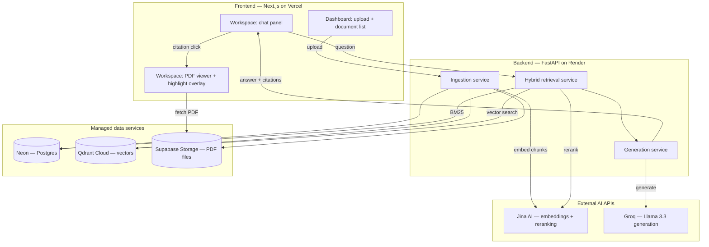

# RAG Document Assistant

An explainable, source-cited document Q&A system. Upload a PDF, ask questions
in plain English, and get answers grounded strictly in the document's actual
content — with every claim traceable back to the exact paragraph and page it
came from, highlighted live in an in-browser PDF viewer.

Built as a full-stack, production-deployed final-year project demonstrating
hybrid retrieval-augmented generation (RAG), not just a wrapper around an LLM.

## Live demo



- **App**: https://rag-doc-assistant-alpha.vercel.app
- **API docs**: https://rag-doc-assistant-hjwk.onrender.com/docs

> The backend runs on a free hosting tier and spins down after ~15 minutes of
> inactivity. The first request after a period of idle time may take
> 30–60 seconds to respond while the server wakes up — this is expected,
> not a bug.

## Why this project is more than "chat with your PDF"

Most student RAG projects embed a document and ask an LLM to answer from the
top-k similarity matches. This project goes further:

- **Hybrid retrieval**, not just vector search — keyword search (BM25) and
  dense vector search run independently and are merged with Reciprocal Rank
  Fusion, so exact terms/numbers and paraphrased/conceptual questions are
  both handled well.
- **Cross-encoder reranking** on the fused candidate set for a precision
  pass before anything reaches the LLM.
- **Structured, validated citations** — the LLM returns machine-readable
  `chunk_id` references, which are checked against the chunks it was
  actually given (hallucinated citations are filtered out, not trusted).
- **Coordinate-aware chunking** — every chunk retains its exact bounding box
  on the PDF page, so a citation isn't just "page 4," it's a highlighted
  rectangle over the precise paragraph.
- **Measured, not assumed, retrieval quality** — hybrid retrieval was
  evaluated against BM25-only and vector-only baselines on a hand-labeled
  question set (see [Evaluation](#evaluation) below), including a
  documented failure case and a tested (unsuccessful) mitigation attempt.
- **A real deployment**, not just a localhost demo — six managed cloud
  services wired together, including working around free-tier memory limits
  by moving ML inference off the server entirely.

## Architecture



### Retrieval pipeline in detail

```
Question
   │
   ├──► BM25 keyword search (cached per document)  ──┐
   │                                                    ├──► Reciprocal Rank Fusion
   └──► Dense vector search (Qdrant Cloud)      ──────┘         │
                                                                  ▼
                                                    Cross-encoder rerank (Jina)
                                                                  │
                                                                  ▼
                                                     Top 5 chunks → LLM (Groq)
                                                                  │
                                                                  ▼
                                          Structured JSON: {answer, citations}
                                                                  │
                                                                  ▼
                                    Citations validated against chunks actually
                                    sent to the LLM — hallucinated IDs discarded
```

## Tech stack

| Layer | Choice | Notes |
|---|---|---|
| Frontend | Next.js (App Router) + Tailwind CSS | Deployed on Vercel |
| PDF rendering | `react-pdf` (PDF.js) | Custom bbox-based highlight overlay |
| Backend | FastAPI (Python) | Deployed on Render (Docker) |
| Database | PostgreSQL via Neon | Users, documents, chunk metadata, chat history |
| Vector store | Qdrant Cloud | 1024-dim vectors, payload-indexed for filtering |
| File storage | Supabase Storage (S3-compatible) | Presigned URLs for direct PDF serving |
| Embeddings | Jina AI API (`jina-embeddings-v3`) | Asymmetric — separate query/passage tasks |
| Reranking | Jina AI API (`jina-reranker-v2-base-multilingual`) | Cross-encoder over the fused shortlist |
| LLM generation | Groq API (Llama 3.3 70B) | Structured JSON output, citation-validated |
| PDF parsing | PyMuPDF (`fitz`) | Extracts text blocks *with* bounding boxes |
| Keyword search | `rank_bm25` | Per-document index, cached, rebuilt on new upload |

### Why hosted APIs instead of local models

Embeddings and reranking originally ran as local models (`sentence-transformers`,
then `fastembed`/ONNX Runtime). Both were moved to hosted APIs (Jina AI) after
repeated out-of-memory failures on free-tier hosting (512MB RAM) — even a
"small" local embedding model plus PyTorch/ONNX runtime overhead, combined
with the rest of the FastAPI stack, exceeded that ceiling. This is documented
here deliberately: it was a diagnosed, evidence-based architecture decision,
not a default choice.

## Evaluation

Retrieval quality was measured against a 12-question, hand-labeled ground
truth set built from a real uploaded research paper, comparing three
strategies: BM25 alone, vector search alone, and the full hybrid + rerank
pipeline.

| Method | Hit@5 | MRR@5 |
|---|---|---|
| BM25 only | 1.000 | 0.722 |
| Vector only | 1.000 | 0.799 |
| **Hybrid + rerank** | 0.917 | **0.875** |

- **Hit@5**: did a correct-page chunk appear anywhere in the top 5 results?
- **MRR@5**: how highly was the *first* correct chunk ranked? (rewards
  precision, not just presence)

**Takeaway**: hybrid + rerank has a marginally lower Hit@5 than the
baselines, but a meaningfully higher MRR@5 — the reranker's real value is
promoting the correct chunk to rank 1 rather than leaving it buried at rank
3–5, which matters because only the top 5 chunks are ever passed to the LLM.

### A documented limitation

One retrieval failure was investigated in depth: a query asking for the
paper's self-attention *formula* failed to retrieve the correct chunk in the
hybrid+rerank pipeline, despite both individual methods (BM25, vector) having
it in their top 5. Root-cause analysis traced this to PyMuPDF extracting
mathematical notation as Unicode mathematical-alphanumeric characters (e.g.
`𝑦 = softmax(𝑊⋅ℎ+𝑏)`) rather than standard text — lexically unusual to both
the embedding model and reranker despite being semantically correct.

As a mitigation attempt, a substantially larger reranker
(`bge-reranker-large`, 2.24GB vs. the 280MB base model) was evaluated; it
did **not** resolve the miss and slightly reduced overall MRR@5 (0.833 vs.
0.875), confirming the issue is text-extraction fidelity, not reranker
capacity. A production system would address this with equation-aware PDF
parsing rather than a larger general-purpose reranker.

Full per-question results: [`backend/evaluation/results.json`](backend/evaluation/results.json)

Reproduce locally:
```bash
cd backend
python evaluate_retrieval.py
```

## Project structure

```
rag-doc-assistant/
├── backend/
│   ├── app/
│   │   ├── main.py                 FastAPI entrypoint
│   │   ├── core/
│   │   │   ├── config.py           Settings (env-driven)
│   │   │   ├── db.py                Postgres session management
│   │   │   ├── deps.py              Auth dependency (see Known limitations)
│   │   │   ├── vectorstore.py       Qdrant client + collection setup
│   │   │   └── storage.py           Supabase Storage (S3-compatible) client
│   │   ├── models/models.py         SQLAlchemy models
│   │   ├── schemas/schemas.py       Pydantic request/response schemas
│   │   ├── routers/                 documents.py, chat.py, health.py
│   │   └── services/
│   │       ├── pdf_parser.py        Text + bbox extraction (PyMuPDF)
│   │       ├── chunker.py           Merges blocks into retrieval-sized chunks
│   │       ├── embeddings.py        Jina AI embeddings client
│   │       ├── bm25_index.py        Per-document cached BM25 index
│   │       ├── vector_search.py     Qdrant similarity search
│   │       ├── reranker.py          Jina AI reranking client
│   │       ├── retrieval.py         Hybrid search orchestrator (RRF + rerank)
│   │       ├── generation.py        Groq LLM call + citation validation
│   │       └── ingestion.py         Full upload → chunks → vectors pipeline
│   ├── evaluation/
│   │   ├── eval_dataset.json        Hand-labeled ground truth questions
│   │   └── results.json             Full evaluation output
│   ├── evaluate_retrieval.py        Evaluation script (BM25 vs vector vs hybrid)
│   ├── test_ingestion.py            Standalone parsing/chunking test script
│   └── requirements.txt
└── frontend/
    ├── app/
    │   ├── page.tsx                 Dashboard (upload + document list)
    │   └── documents/[id]/page.tsx  Workspace (chat + PDF side by side)
    ├── components/
    │   ├── upload/                  UploadDropzone, DocumentList
    │   ├── chat/                    ChatPanel, ChatMessage, CitationBadge
    │   └── pdf-viewer/               PdfViewer, HighlightOverlay
    └── lib/
        ├── api.ts                   Typed backend API client
        └── types.ts                 Shared TypeScript types
```

## Local development setup

No Docker required — local development connects to the same managed cloud
services as production (Neon, Qdrant Cloud, Supabase Storage), keeping the
two environments consistent.

### Prerequisites
- Python 3.11+
- Node.js 18+
- Free accounts: [Neon](https://neon.tech), [Qdrant Cloud](https://cloud.qdrant.io),
  [Supabase](https://supabase.com), [Jina AI](https://jina.ai), [Groq](https://console.groq.com)

### Backend

```bash
cd backend
python3 -m venv venv
source venv/bin/activate      # Windows: venv\Scripts\activate
pip install -r requirements.txt

cp .env.example .env
# Fill in: DATABASE_URL (Neon), QDRANT_URL + QDRANT_API_KEY, JINA_API_KEY,
# GROQ_API_KEY, SUPABASE_* variables, JWT_SECRET_KEY (any random string)

uvicorn app.main:app --reload
```

Visit `http://localhost:8000/docs` to confirm all routes are live.

### Frontend

```bash
cd frontend
npm install
cp .env.local.example .env.local
# Set NEXT_PUBLIC_API_BASE to http://localhost:8000 for local backend,
# or the live Render URL to develop against production data

npm run dev
```

Visit `http://localhost:3000`.

### Verify the pipeline end-to-end

```bash
# Isolated parsing/chunking test (no server needed)
cd backend
python test_ingestion.py /path/to/any.pdf

# Full upload + retrieval test against a running backend
curl -X POST http://localhost:8000/documents/upload -F "file=@/path/to/any.pdf"
curl "http://localhost:8000/documents/<document_id>/search?q=your+question"
```

## Known limitations

- **Authentication is a placeholder.** All requests currently run as a
  single auto-created "dev user" (`app/core/deps.py`), isolated behind one
  function so real JWT auth can be swapped in without touching any router.
  Fine for a single-user demo; not production-ready for multiple real users.
- **Equation-heavy content retrieves less reliably** — see
  [Evaluation](#evaluation) above.
- **Cold starts on the free-tier backend** — see the note under
  [Live demo](#live-demo).
- **BM25 index rebuilds are cached per-document but not fully incremental**
  (see `backend/app/services/bm25_index.py` docstring) — a deliberate
  scope tradeoff for a single-instance deployment, documented as a known
  scaling limitation rather than solved.

## Deployment notes

The live deployment uses six managed services across three free-tier
providers (Vercel, Render, Neon/Qdrant Cloud/Supabase/Jina/Groq). Getting
here involved several real engineering pivots worth noting:

- Switched embedding/reranking from local models to hosted APIs after
  hitting Render's 512MB memory ceiling with local ML inference.
- Switched file storage from local disk to Supabase Storage after
  discovering Render's filesystem is ephemeral — uploaded PDFs were being
  wiped on every redeploy even though database records persisted.
- Switched planned file storage provider from Cloudflare R2 to Supabase
  Storage specifically to avoid a mandatory credit-card requirement on R2's
  free tier.

For a detailed write-up of specific bugs encountered and how each was
diagnosed, see [docs/DEPLOYMENT_CHALLENGES.md](docs/DEPLOYMENT_CHALLENGES.md).

## License

Built as a final-year academic project.